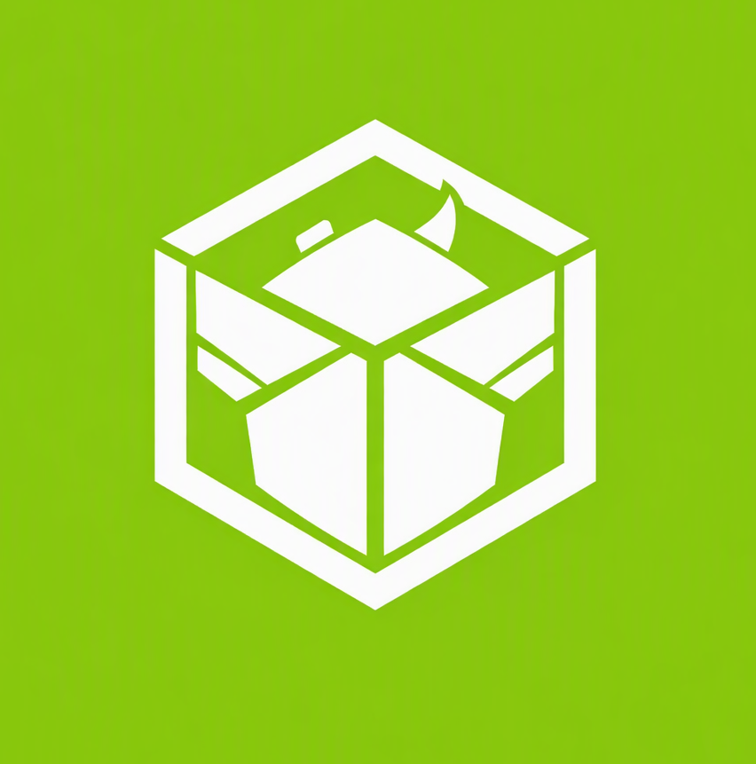
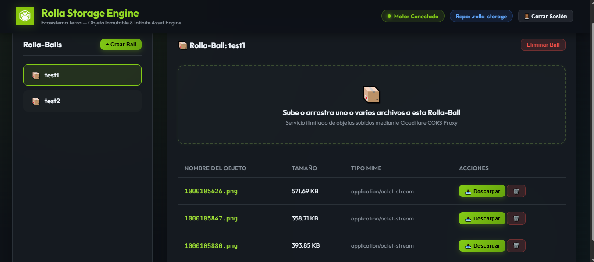

<div align="center">

  

  # 📦 ROLLA STORAGE ENGINE
  ### *Motor de Almacenamiento de Objetos Inmutable e Ilimitado a Coste $0*

  [](https://github.com/amglogicalis/Terra)
  [](https://amglogicalis.github.io/rolla-repo-public/)
  [](LICENSE)

</div>

---

## 📌 Visión General

**Rolla** (`@terra/rolla`) es un motor de almacenamiento de objetos inmutable de alto rendimiento (estilo AWS S3) diseñado para el ecosistema **Terra**. Utiliza la infraestructura global de **GitHub Releases & Assets** alojada en la nube de GitHub sobre un repositorio privado (`.rolla-storage`) para ofrecer espacio de almacenamiento ilimitado a **coste $0** sin saturar ramas ni repositorios Git.

---

## 📸 Vista Previa de la Consola Web

<div align="center">
  
</div>

---

## 🌟 Características Destacadas

- ♾️ **Coste $0 y Almacenamiento Ilimitado**: Aprovecha la CDN de Releases de GitHub sin cuotas de subida ni suscripciones.
- 📦 **Rolla-Balls (Buckets)**: Mapeadas internamente como Releases firmadas con tags git `rolla-bkt-<nombre>`.
- ⚡ **Sincronización Instantánea**: Consulta de tags vía Git Refs (`/git/refs/tags`) eliminando latencias de caché.
- 🧩 **Automatic Chunking (>2 GB)**: División y ensamblado transparente para archivos gigantescos.
- 🌐 **Consola Web Estática (GitHub Pages)**: Interfaz cliente 24/7 totalmente responsive para PC y dispositivos móviles.
- 💻 **CLI & Servidor Local**: Herramienta de consola para terminal y servidor local de desarrollo.
- 🔒 **Seguridad y Privacidad**: Tu token PAT se guarda localmente en tu cliente (`localStorage`), jamás en servidores externos.

---

## 💻 Todos los Comandos del CLI (`npx rolla`)

La herramienta CLI de **Rolla** permite gestionar tus objetos y lanzar consolas de desarrollo con una serie de comandos flexibles:

| Comando | Descripción | Ejemplo de Uso |
| :--- | :--- | :--- |
| `npx rolla console` | **Lanza la Consola Web local** en tu navegador (`http://localhost:3000`). | `npx rolla console` |
| `npx rolla console --logs` | Lanza la consola web local mostrando en terminal los **logs detallados** de peticiones HTTP, eventos y errores. | `npx rolla console --logs` |
| `npx rolla console --port <puerto>` | Especifica un **puerto personalizado** para la consola web en caso de conflicto. | `npx rolla console --port 8080` |
| `npx rolla list` | **Lista todas las Rolla-Balls (buckets)** existentes en tu cuenta. | `npx rolla list` |
| `npx rolla create <ball-name>` | **Crea una nueva Rolla-Ball** en la nube. | `npx rolla create fotos-2026` |
| `npx rolla delete <ball-name>` | **Elimina una Rolla-Ball** y todos los objetos contenidos. | `npx rolla delete fotos-2026` |
| `npx rolla ls <ball-name>` | **Lista los objetos y archivos** dentro de una Rolla-Ball específica. | `npx rolla ls fotos-2026` |
| `npx rolla put <ball-name> <file-path>` | **Subir un archivo** a la Rolla-Ball especificada. | `npx rolla put fotos-2026 ./imagen.png` |
| `npx rolla get <ball-name> <key> [dest]` | **Descarga un objeto** desde una Rolla-Ball a tu disco local. | `npx rolla get fotos-2026 imagen.png ./foto.png` |

---

## 🌐 Uso desde la Consola Web (GitHub Pages)

Accede a la Consola Web desplegada 24/7 desde cualquier navegador de ordenador o teléfono móvil:

👉 **[https://amglogicalis.github.io/rolla-repo-public/](https://amglogicalis.github.io/rolla-repo-public/)**

1. Ingresa tu **GitHub Personal Access Token (PAT)** con permisos de `repo`.
2. Crea tus **Rolla-Balls** de forma visual.
3. Arrastra y sube archivos o imágenes sin límites de tamaño ni errores CORS.

---

## 🚀 Uso desde el SDK (TypeScript / JavaScript)

```bash
npm install @terra/rolla
```

```typescript
import { Rolla } from '@terra/rolla';

const rolla = new Rolla({
  githubToken: process.env.ROLLA_PAT
});

// 1. Crear un contenedor (Rolla-Ball)
await rolla.createBall('imagenes-prod');

// 2. Subir un archivo
await rolla.putObject('imagenes-prod', 'fotografia.png', bufferData, {
  contentType: 'image/png'
});

// 3. Listar archivos
const objects = await rolla.listObjects('imagenes-prod');
console.log(objects);

// 4. Descargar archivo
const buffer = await rolla.getObject('imagenes-prod', 'fotografia.png');
```

---

## 📜 Licencia

Este proyecto está distribuido bajo la **Licencia MIT**. Siéntete libre de modificarlo, distribuirlo y usarlo en tus aplicaciones privadas o comerciales. Consulta el archivo [`LICENSE`](LICENSE) para más detalles.

---

<div align="center">
  <sub>Desarrollado con ❤️ para el Ecosistema Terra</sub>
</div>
