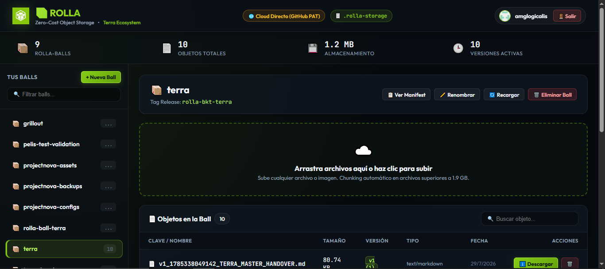

<div align="center">

  

  # 📦 ROLLA STORAGE ENGINE v2.0
  ### *Motor de Almacenamiento de Objetos Inmutable e Ilimitado a Coste $0 para el Ecosistema Terra*

  [](https://www.npmjs.com/package/terra-rolla)
  [](https://github.com/amglogicalis/Terra)
  [](https://amglogicalis.github.io/rolla-repo-public/)
  [](https://github.com/amglogicalis/rolla-repo-public/blob/main/rolla-e2e-test.mjs)
  [](https://opensource.org/licenses/MIT)

  <p align="center">
    <a href="https://amglogicalis.github.io/rolla-repo-public/">
      
    </a>
  </p>

</div>

---

<div align="center">

### 🖥️ Consola Web Rolla 2.0 (Vista Previa)
[](https://amglogicalis.github.io/rolla-repo-public/)
*Interfaz moderna Glassmorphic con soporte dual: Online 24/7 en GitHub Pages y servidor local integrado en CLI.*

</div>

---

## 📌 ¿Qué es Rolla?

**Rolla** (`terra-rolla`) es el motor de almacenamiento de objetos (estilo AWS S3) diseñado para el **Ecosistema Terra**. Proporciona persistencia masiva inmutable a **coste económico $0** aprovechando la infraestructura de **GitHub Releases y Assets** sobre tu propio repositorio privado (`.rolla-storage`), sin saturar el árbol de Git, con versionado automático, soporte de fragmentación (*chunking*) para archivos gigantes (>1.9 GB) y **desacoplado al 100% de Cloudflare o dependencias externas**.

Rolla puede utilizarse de tres formas complementarias:
1. **Consola Web Online**: Desplegada en GitHub Pages, lista para usarse desde cualquier navegador sin instalar nada.
2. **CLI de Terminal**: Herramienta de línea de comandos para automatización, scripting y gestión directa.
3. **SDK TypeScript / JavaScript**: Biblioteca lista para integrar en cualquier aplicación o backend del Ecosistema Terra.

---

## 🌟 Características Principales

* ♾️ **Coste $0 y Almacenamiento Ilimitado**: Todo se guarda en tu repositorio privado `.rolla-storage` utilizando Releases y Assets de GitHub.
* 🛡️ **Cero Dependencia de Cloudflare**: Comunicación nativa directa con la API de GitHub; sin workers, proxies lentos ni intermediarios.
* 📦 **Rolla-Balls (Buckets)**: Contenedores mapeados como Releases de GitHub identificados con el tag canónico `rolla-bkt-<nombre>`.
* ⚡ **Consistencia Inmediata (Zero-Cache)**: Lee los tags directamente a través de Git Refs (`/git/refs/tags`), eliminando por completo los 60 segundos de caché del CDN de Releases.
* 🧩 **Motor de Deep Chunking (> 1.9 GB)**: Particiona automáticamente archivos mayores al límite de GitHub en bloques de 1.9 GB, calculando hashes SHA-256 por fragmento y reensamblándolos sin pérdida de datos ni corrupción.
* 🕒 **Versionado Inmutable**: Cada subida conserva el historial de versiones (`v1`, `v2`, `v3`...), permitiendo consultar y descargar versiones históricas específicas mediante su `versionId`.
* 📋 **Manifest Dual de Cero Latencia**: El catálogo `_manifest.json` se almacena como asset y se sincroniza en el cuerpo de la Release (`<!-- ROLLA_MANIFEST_START -->`), permitiendo lectura instantánea en navegadores con 0 peticiones de red extra y sin problemas de CORS.
* ✏️ **Edición y Renombrado Atómico**: Soporte para renombrar Rolla-Balls y editar las claves de los objetos preservando su histórico de versiones.
* 💻 **Consola Web Dual-Mode**: Funciona tanto en la nube (GitHub Pages) como en modo servidor local (`rolla console`) con puerto personalizable (`--port`) y soporte CORS.
* 🔐 **Seguridad Terra**: Autenticación clásica mediante GitHub PAT (Personal Access Token) con cifrado en sesión local, indicador de perfil de usuario y botón de cierre de sesión seguro.

---

## 🚀 Instalación Rápida

### Para Terminal (CLI Global):
```bash
npm install -g terra-rolla
```
*O úsalo directamente con `npx`:*
```bash
npx terra-rolla ls
```

### Para Proyectos Node.js / TypeScript (SDK):
```bash
npm install terra-rolla
```

---

## 🖥️ Consola Web Rolla (Online & Local)

### 🌐 Modo Online (GitHub Pages 24/7)
Accede directamente sin instalar nada:
👉 **[https://amglogicalis.github.io/rolla-repo-public/](https://amglogicalis.github.io/rolla-repo-public/)**

1. Haz clic en **🔑 Conectar PAT** e introduce tu GitHub Personal Access Token con permisos `repo`.
2. La consola detecta y auto-crea tu repositorio `.rolla-storage` si no existe.
3. Arrastra archivos a la zona de subida, visualiza hashes SHA-256, inspecciona el `_manifest.json` y gestiona versiones con un solo clic.

### 💻 Modo Local (CLI Daemon)
Lanza la consola en tu entorno local con servidor REST integrado:
```bash
rolla console
```
*Por defecto se inicia en `http://localhost:3750` y abre tu navegador automáticamente.*

**Opciones de consola:**
```bash
# Cambiar el puerto si el 3750 está ocupado:
rolla console --port 8080

# Ver los logs HTTP en tiempo real en la terminal:
rolla console --logs

# Iniciar sin abrir el navegador automáticamente:
rolla console --no-open
```

---

## 💻 Guía del CLI (`rolla`)

El CLI permite ejecutar todas las operaciones de almacenamiento desde terminal o scripts de CI/CD:

```
📦 ROLLA CLI v2.0.0 — Terra Ecosystem Zero-Cost Object Storage Engine

COMANDOS DISPONIBLES:
  rolla console [--port <num>] [--logs]   Lanza la Consola Web local (puerto por defecto: 3750)
  rolla studio  [--port <num>]            Alias de console
  rolla ls                                Lista todas las Rolla-Balls registradas
  rolla ls <ball>                         Lista los objetos y versiones dentro de una Rolla-Ball
  rolla create <ball>                     Crea una nueva Rolla-Ball
  rolla upload <ball> <file> [key]        Sube un archivo (soporta chunking automático >1.9GB)
  rolla rm <ball> [key]                   Elimina un objeto o una Rolla-Ball completa
  rolla rename <ball> <nuevo-nombre>     Renombra una Rolla-Ball atómicamente
  rolla edit <ball> <antigua> <nueva>     Renombra/edita la clave de un objeto en el manifest
  rolla version                           Muestra la versión de terra-rolla

OPCIONES GLOBALES:
  --port, -p <num>    Puerto para la Consola Web (ej. --port 3750)
  --logs              Muestra los logs de peticiones HTTP en la terminal
  --no-open           No abre el navegador automáticamente al iniciar la consola
  --token <pat>       Token PAT de GitHub (por defecto: process.env.GITHUB_TOKEN)
  --repo <nombre>     Repositorio de almacenamiento (por defecto: .rolla-storage)
```

### Ejemplos Prácticos de CLI

```bash
# 1. Crear una nueva Rolla-Ball (Bucket)
rolla create backups-produccion

# 2. Listar todas las Balls
rolla ls

# 3. Subir un archivo (si supera 1.9 GB, se fragmenta automáticamente en chunks)
rolla upload backups-produccion ./database-dump.sql

# 4. Subir con una clave personalizada
rolla upload backups-produccion ./imagen.png avatar-principal.png

# 5. Listar objetos dentro de la Ball
rolla ls backups-produccion

# 6. Editar / renombrar un objeto en el catálogo
rolla edit backups-produccion avatar-principal.png avatar-v2.png

# 7. Renombrar una Rolla-Ball completa
rolla rename backups-produccion backups-historicos

# 8. Eliminar un objeto
rolla rm backups-historicos avatar-v2.png

# 9. Eliminar la Rolla-Ball completa
rolla rm backups-historicos
```

---

## 📦 Guía del SDK (TypeScript & JavaScript)

### Inicialización

```typescript
import { Rolla } from 'terra-rolla';

const rolla = new Rolla({
  githubToken: process.env.GITHUB_TOKEN!,
  storageRepo: '.rolla-storage',      // Opcional, por defecto .rolla-storage
  chunkSizeLimit: 1.9 * 1024 * 1024 * 1024 // Opcional, umbral de chunking en bytes (1.9 GB)
});
```

---

### 1. Gestión de Rolla-Balls (Buckets)

```typescript
// Crear una nueva Rolla-Ball
await rolla.createBall('dataset-ia');

// Listar todas las Rolla-Balls con consistencia inmediata (Git Refs)
const balls = await rolla.listBalls();
console.log('Buckets disponibles:', balls); // ['dataset-ia', 'backups', ...]

// Renombrar una Rolla-Ball
await rolla.renameBall('dataset-ia', 'dataset-ia-2026');

// Eliminar una Rolla-Ball y sus objetos asociados
await rolla.deleteBall('dataset-ia-2026');
```

---

### 2. Subida de Objetos y Chunking Automático

Rolla detecta automáticamente si el archivo excede el tamaño límite configurado y aplica chunking transparente:

```typescript
import * as fs from 'node:fs';

const fileBuffer = fs.readFileSync('./modelo-ia.bin');

// Subir objeto (aplica chunking si > 1.9 GB y calcula SHA-256)
const metadata = await rolla.putObject('dataset-ia', 'modelo-ia.bin', fileBuffer, {
  contentType: 'application/octet-stream'
});

console.log('Objeto almacenado:', {
  clave: metadata.key,
  version: metadata.versionId,
  sha256: metadata.sha256,
  estaFragmentado: metadata.chunked,
  partes: metadata.chunks?.length || 1
});
```

---

### 3. Descarga y Reensamblado con Verificación Criptográfica

Al descargar un objeto fragmentado, Rolla descarga los chunks, comprueba los hashes SHA-256 y los reensambla bit a bit:

```typescript
// Descargar la última versión del objeto (reensamblado automático)
const dataBuffer = await rolla.getObject('dataset-ia', 'modelo-ia.bin');
fs.writeFileSync('./modelo-ia-restaurado.bin', dataBuffer);

// Descargar una versión histórica específica
const dataV1 = await rolla.getObject('dataset-ia', 'modelo-ia.bin', {
  versionId: 'v1_1727700000000'
});
```

---

### 4. Historial de Versionado Inmutable

Cada vez que se sube un archivo con la misma clave, Rolla no sobrescribe los datos destructivamente, sino que agrega una nueva entrada inmutable:

```typescript
// Subir una nueva versión
await rolla.putObject('dataset-ia', 'modelo-ia.bin', nuevoBuffer);

// Consultar el historial completo de versiones de un archivo
const versiones = await rolla.listObjectVersions('dataset-ia', 'modelo-ia.bin');
versiones.forEach(v => {
  console.log(`Versión: ${v.versionId} | Fecha: ${v.createdAt} | Tamaño: ${v.size} bytes | SHA256: ${v.sha256}`);
});
```

---

### 5. Edición y Renombrado de Objetos

```typescript
// Renombrar la clave de un objeto conservando todo su árbol de versiones
await rolla.renameObject('dataset-ia', 'modelo-ia.bin', 'modelo-ia-final.bin');
```

---

### 6. Inspección del Manifest

```typescript
// Obtener el catálogo completo de metadatos de la Ball
const manifest = await rolla.getManifest('dataset-ia');
console.log('Manifest:', JSON.stringify(manifest, null, 2));
```

---

### 7. Eliminación Granular

```typescript
// Eliminar únicamente una versión específica
await rolla.deleteObject('dataset-ia', 'modelo-ia-final.bin', {
  versionId: 'v1_1727700000000'
});

// Eliminar el objeto completo y todas sus versiones
await rolla.deleteObject('dataset-ia', 'modelo-ia-final.bin');
```

---

## 🌐 API REST Local (Daemon HTTP)

Al iniciar `rolla console`, el proceso expone una API REST local con soporte CORS completo (`Access-Control-Allow-Origin: *`):

| Método | Endpoint | Descripción |
| :--- | :--- | :--- |
| `GET` | `/api/health` | Estado del daemon, versión y usuario autenticado |
| `GET` | `/api/balls` | Lista todas las Rolla-Balls |
| `POST` | `/api/balls` | Crea una Rolla-Ball (`{ "name": "mi-ball" }`) |
| `PUT` | `/api/balls/:ball/rename` | Renombra una Ball (`{ "newName": "nuevo-nombre" }`) |
| `DELETE` | `/api/balls/:ball` | Elimina una Rolla-Ball y sus objetos |
| `GET` | `/api/balls/:ball/manifest` | Devuelve el `_manifest.json` completo |
| `GET` | `/api/balls/:ball/objects` | Lista los objetos y versiones de la Ball |
| `GET` | `/api/balls/:ball/objects/:key/versions` | Lista el historial de versiones de un objeto |
| `PUT` | `/api/balls/:ball/objects/:key/rename` | Renombra un objeto (`{ "newKey": "nueva-clave" }`) |
| `POST` | `/api/balls/:ball/upload` | Sube un archivo mediante multipart/form-data |
| `GET` | `/api/balls/:ball/download/:key` | Descarga el archivo (acepta `?versionId=...`) |
| `DELETE` | `/api/balls/:ball/objects/:key` | Elimina el objeto (acepta `?versionId=...`) |

---

## 🧩 Cómo Funciona el Deep Chunking Engine

GitHub impone un límite de **2 GB por asset** en sus Releases. Rolla supera esta barrera de forma transparente:

```
[ ARCHIVO ORIGINAL (> 1.9 GB) ] 
               │
               ▼  (Calcula SHA-256 Global)
     [ Chunker Engine ]
    ┌──────────┼──────────┐
    ▼          ▼          ▼
Chunk 1    Chunk 2    Chunk 3... (hasta 1.9 GB c/u)
(SHA-256)  (SHA-256)  (SHA-256)
    │          │          │
    ▼          ▼          ▼
[ Subida a GitHub Release Assets en paralelo ]
    │
    ▼
[ Registro en _manifest.json con mapa de fragmentos y hashes ]
```

1. **Partición**: El archivo se divide en bloques de 1.9 GB (`_chunk_001.bin`, `_chunk_002.bin`, etc.).
2. **Hasheo Criptográfico**: Cada bloque genera su propio hash SHA-256 antes de subir.
3. **Reensamblado Seguro**: Al solicitar la descarga, los fragmentos se descargan, se ordenan secuencialmente y se verifica su integridad. Si se detecta corrupción en un solo byte, el motor aborta la operación para proteger la fidelidad de los datos.

---

## 🧪 Batería de Pruebas E2E (End-to-End)

El repositorio incluye un conjunto exhaustivo de pruebas automatizadas con **50/50 tests superados (100% de éxito)**:

```bash
node rolla-e2e-test.mjs
```

### Áreas Validadas:
* `[0]` Validación de entorno, configuración y formato de tokens.
* `[1]` Arquitectura del SDK e inicialización configurable del `Chunker`.
* `[2]` Motor de Deep Chunking (>1.9 GB), ordenación y detección de manipulación de datos.
* `[3]` Ciclo de vida de Rolla-Balls y consistencia inmediata con Git Refs.
* `[4]` Operaciones de objetos (Put, Get, List y validación SHA-256).
* `[5]` Historial de versionado e inmutabilidad.
* `[6]` Consistencia atómica del `_manifest.json` y lectura dual desde `release.body`.
* `[7]` Simulación completa del CLI de terminal (flags, comandos y ayuda).
* `[8]` Servidor integrado de la consola web, preflight OPTIONS y cabeceras CORS.
* `[9]` Limpieza automática del entorno de pruebas.

---

## 🌍 Rolla en el Ecosistema Terra

Rolla actúa como la capa de persistencia binaria y almacenamiento de objetos para las demás herramientas de Terra:
* **Formica**: Conecta con Rolla como proveedor de persistencia para almacenar exportaciones y dumps de datos.
* **Libella**: Almacena bundles y assets compilados sin coste de almacenamiento en la nube.
* **Waisp**: Almacena backups y registros de auditoría de microservicios.

---

## 📜 Licencia

Distribuido bajo la **Licencia MIT**. Desarrollado para el **Ecosistema Terra**.
