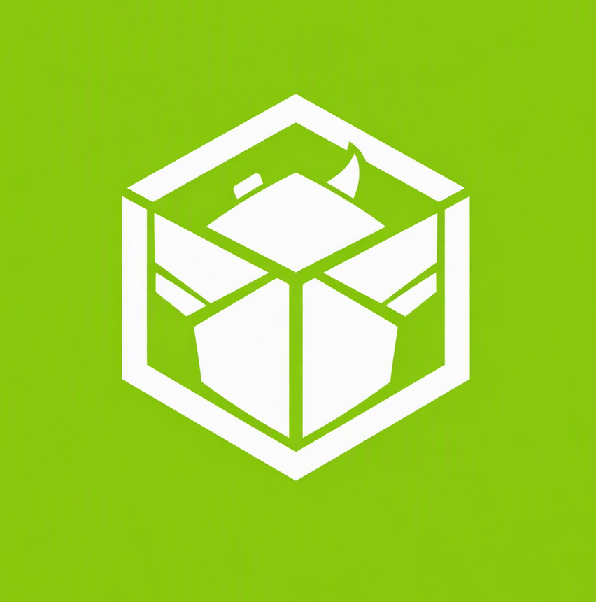

<div align="center">

  

  # 📦 ROLLA STORAGE ENGINE v2.0
  ### *Motor de Almacenamiento de Objetos Inmutable e Ilimitado a Coste $0 para el Ecosistema Terra*

  [](https://www.npmjs.com/package/terra-rolla)
  [](https://github.com/amglogicalis/Terra)
  [](https://amglogicalis.github.io/rolla-repo-public/)
  [](https://github.com/amglogicalis/rolla-repo-public/blob/main/rolla-e2e-test.mjs)
  [](https://opensource.org/licenses/MIT)

</div>

---

## 📌 Visión General

**Rolla** (`terra-rolla`) es el motor de almacenamiento de objetos inmutable (estilo AWS S3) del **Ecosistema Terra**. Respaldado íntegramente sobre **GitHub Releases & Assets** en tu repositorio privado (`.rolla-storage`), proporciona almacenamiento masivo a **coste económico $0**, sin saturar el historial de Git, con versionado de archivos, chunking automático para ficheros gigantes y **cero dependencias de proveedores externos (cero Cloudflare)**.

---

## 🚀 Instalación

### 🌐 CLI Global (Terminal):
```bash
npm install -g terra-rolla
```

### 📦 En proyectos Node.js / TypeScript (SDK):
```bash
npm install terra-rolla
```

---

## 🌟 Características Clave

- ♾️ **Coste $0 y Almacenamiento Ilimitado**: Infraestructura en la nube sobre GitHub Releases & Assets en tu repositorio privado `.rolla-storage`.
- 🛡️ **100% Desacoplado de Cloudflare**: Opera directamente de forma nativa con el motor de GitHub y la arquitectura Terra sin intermediarios ni proxies externos.
- 📦 **Rolla-Balls (Buckets)**: Contenedores mapeados como Releases de GitHub con tags canónicos `rolla-bkt-<nombre>`.
- ⚡ **Consistencia Inmediata (Zero-Cache)**: Consulta tags mediante Git Refs (`/git/refs/tags`) eliminando los 60 segundos de caché del CDN de Releases.
- 🧩 **Deep Chunking Engine (> 1.9 GB)**: División automática y reensamblado secuencial con verificación de integridad criptográfica SHA-256 byte a byte.
- 🕒 **Historial de Versionado Inmutable**: Cada subida de un mismo archivo almacena una nueva versión (`v1`, `v2`...), permitiendo consultar y descargar cualquier versión anterior.
- 📋 **Catálogo `_manifest.json` Atómico**: Metadatos centralizados, tipos MIME, tamaños, hashes SHA-256 y mapa de fragmentos.
- 🖥️ **Consola Web Terra 2.0 (Dual-Mode)**: Interfaz glassmorphic moderna con pop-up clásico de autenticación con GitHub PAT, panel de perfil con botón de cierre de sesión, explorador interactivo y drag & drop.
- 💻 **CLI Potente con Puerto Configurable**: Lanza la consola con `rolla console --port 3750` con auto-resolución de conflictos de puerto (`EADDRINUSE`).

---

## 💻 Comandos del CLI (`rolla`)

| Comando | Descripción | Ejemplo de Uso |
| :--- | :--- | :--- |
| `rolla console` | **Lanza la Consola Web local** en tu navegador (puerto por defecto: `3750`). | `rolla console` |
| `rolla console --port <puerto>` | Especifica un **puerto personalizado** (ej. 3750, 8080). | `rolla console --port 3750` |
| `rolla console --logs` | Lanza la consola mostrando **logs HTTP detallados** en terminal. | `rolla console --logs` |
| `rolla studio` | Alias de `rolla console`. | `rolla studio` |
| `rolla ls` | **Lista todas las Rolla-Balls** registradas en `.rolla-storage`. | `rolla ls` |
| `rolla ls <ball>` | **Lista los objetos y versiones** dentro de una Ball. | `rolla ls fotos-2026` |
| `rolla create <ball>` | **Crea una nueva Rolla-Ball** de forma atómica. | `rolla create backups-prod` |
| `rolla upload <ball> <file> [key]` | **Sube un archivo** (soporta chunking automático si excede 1.9 GB). | `rolla upload fotos-2026 ./dataset.tar.gz` |
| `rolla rename <ball> <nuevo-nombre>` | **Renombra una Rolla-Ball** actualizando tags y manifest. | `rolla rename fotos-2026 fotos-archivo` |
| `rolla rm <ball> [key]` | **Elimina un objeto específico** o una Rolla-Ball completa. | `rolla rm fotos-2026 dataset.tar.gz` |
| `rolla version` | Muestra la versión actual instalada de `terra-rolla`. | `rolla version` |

---

## 🌐 Consola Web Online 24/7 (GitHub Pages)

Accede a la consola web estática desde cualquier navegador de escritorio o móvil:

👉 **[https://amglogicalis.github.io/rolla-repo-public/](https://amglogicalis.github.io/rolla-repo-public/)**

1. Haz clic en **🔑 Conectar PAT** e introduce tu GitHub Personal Access Token con permiso `repo`.
2. Tu sesión se mantendrá en tu cliente con indicador de perfil y botón de cierre de sesión **🚪 Salir**.
3. Arrastra archivos al recuadro de subida o crea Rolla-Balls en un solo clic.

---

## 🚀 Uso del SDK (TypeScript / JavaScript)

```typescript
import { Rolla } from 'terra-rolla';

const rolla = new Rolla({
  githubToken: process.env.GITHUB_TOKEN!,
  storageRepo: '.rolla-storage' // Opcional, por defecto .rolla-storage
});

// 1. Crear una Rolla-Ball (Bucket)
await rolla.createBall('imagenes-prod');

// 2. Subir un archivo (con cálculo automático de SHA-256 y versionado)
const metadata = await rolla.putObject('imagenes-prod', 'foto.png', bufferData, {
  contentType: 'image/png'
});
console.log(`Subido: ${metadata.key} (v${metadata.versionId}) - SHA256: ${metadata.sha256}`);

// 3. Listar archivos de la Ball
const objects = await rolla.listObjects('imagenes-prod');
console.log(objects);

// 4. Descargar la última versión del archivo
const buffer = await rolla.getObject('imagenes-prod', 'foto.png');

// 5. Versionado de Objetos
// Subir una nueva versión de 'foto.png'
await rolla.putObject('imagenes-prod', 'foto.png', nuevoBufferData);

// Listar todas las versiones registradas
const versiones = await rolla.listObjectVersions('imagenes-prod', 'foto.png');
console.log(versiones); // [{ versionId: 'v1_...', ... }, { versionId: 'v2_...', ... }]

// Descargar una versión previa específica
const bufferV1 = await rolla.getObject('imagenes-prod', 'foto.png', { versionId: versiones[0].versionId });

// 6. Eliminar una versión o el objeto completo
await rolla.deleteObject('imagenes-prod', 'foto.png'); // Elimina todas las versiones
await rolla.deleteBall('imagenes-prod'); // Elimina la Ball completa
```

---

## 🧪 Pruebas E2E (End-to-End)

El repositorio cuenta con una suite integral de verificación con **43/43 tests superados (100% éxito)**:

```bash
node rolla-e2e-test.mjs
```

Verifica:
- 🧩 **Chunking (> 1.9 GB)**: División en chunks (`_chunk_001.bin`...), hashes SHA-256 por fragmento, reensamblado bit a bit y detección de corrupción de datos.
- ⚡ **Git Refs**: Consistencia instantánea al crear y renombrar Rolla-Balls.
- 🕒 **Versionado**: Inmutabilidad, recuperación por `versionId` y eliminación granular.
- 💻 **CLI y Daemon**: Parseo de `--port`, preflight CORS y salud de la consola.

---

## 📜 Licencia

Distribuido bajo la **Licencia MIT**. Desarrollado con ❤️ para el **Ecosistema Terra**.
